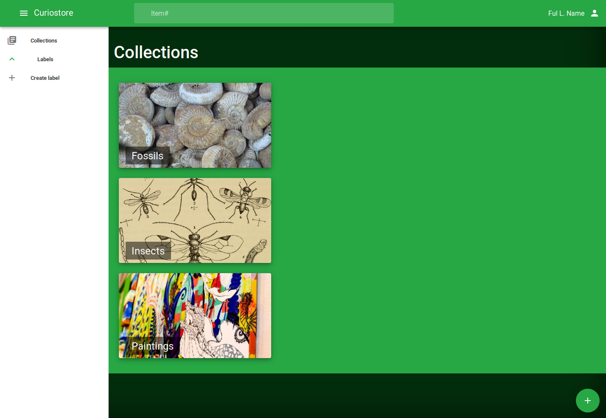

# Curiostore collection manager

Curiostore consists of two sub-projects, the VueJs web interface, and the bottle.py API.

These projects are in the ui and api directories.

The ui is a prototype.

